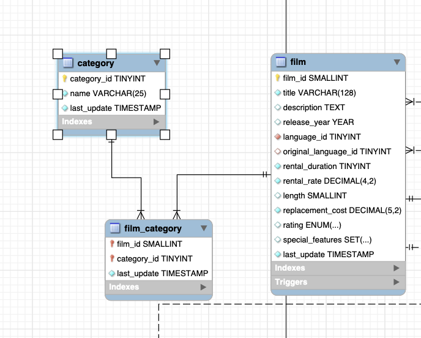

# IDS Week 6

Complicated SQL Query

[](https://github.com/nicholasconterno/IDSWeek6/actions/workflows/python-package.yml)


## Create Tables using mysql command line interface


## Showing the Schema for the tables we will be using for our complex query


## Complex Query (and showing its execution)


## Complex Query explanation
```sql
SELECT 
    c.name AS CategoryName,
    f.rating AS FilmRating,
    AVG(f.rental_rate) AS AvgRentalRate,
    (
        SELECT title 
        FROM film fi
        JOIN film_category fc ON fi.film_id = fc.film_id
        WHERE fc.category_id = c.category_id AND fi.rating = f.rating
        ORDER BY fi.rental_rate DESC, fi.title
        LIMIT 1
    ) AS TopFilm
FROM 
    film f
JOIN 
    film_category fc ON f.film_id = fc.film_id
JOIN 
    category c ON c.category_id = fc.category_id
GROUP BY 
    c.category_id, f.rating
ORDER BY 
    f.rating, AvgRentalRate DESC;
```

First let's look at the SELECT clause:
```sql
c.name AS CategoryName
```
This selects the name of the film category.
```sql
f.rating AS FilmRating
```
 This selects the rating of films 
 ```sql
AVG(f.rental_rate) AS AvgRentalRate
```
 This calculates the average rental rate for each category-rating combination.

```sql
    (
        SELECT title 
        FROM film fi
        JOIN film_category fc ON fi.film_id = fc.film_id
        WHERE fc.category_id = c.category_id AND fi.rating = f.rating
        ORDER BY fi.rental_rate DESC, fi.title
        LIMIT 1
    ) AS TopFilm
```
The nested SELECT gets the title of the film which has the highest rental rate within each category-rating combination. In the case of a tie, it simply selects alphabetically. 

Now let's look at the FROM clause:

film f: This selects data from our film table, and assigns it a name 'f'

Now let's look at our JOIN clauses:

The query joins three tables: film, film_category, and category using their respective keys. 
```sql
film_category fc ON f.film_id = fc.film_id
```
 This join is made on the film ID to get the category ID associated with each film.
 ```sql
category c ON c.category_id = fc.category_id
```
 This join is on the 'category' table to get the name of each category.

Lets look at the WHERE clause now:
```sql
fc.category_id = c.category_id AND fi.rating = f.rating
```
 This ensures that the film that is in this subquery is both in the same category and also has the same rating as the film in the outer query.
Let's look at the GROUP BY clause:
These results are grouped by c.category_id and f.rating so that we get our wanted distinct category-rating combinations.

Finally, let's see our ORDER BY clause:
```sql
ORDER BY 
    f.rating, AvgRentalRate DESC;
```
The final results are sorted by film rating primarily, and then by average rental rate secondarily, in descending order.

## Full Query Results

| CategoryName | FilmRating | AvgRentalRate | TopFilm           |
|--------------|------------|---------------|-------------------|
| New          | G          | 3.656667      | BIRDS PERDITION   |
| Travel       | G          | 3.535455      | BIRD INDEPENDENCE |
| Drama        | G          | 3.490000      | BEAUTY GREASE     |
| Games        | G          | 3.353636      | AUTUMN CROW       |
| Children     | G          | 3.190000      | GHOST GROUNDHOG   |
| Sports       | G          | 3.171818      | DUDE BLINDNESS    |
| Sci-Fi       | G          | 2.990000      | COLDBLOODED DARLING |
| Family       | G          | 2.990000      | CHISUM BEHAVIOR   |
| Action       | G          | 2.767778      | CASUALTIES ENCINO |
| Horror       | G          | 2.767778      | ACE GOLDFINGER    |
| Animation    | G          | 2.682308      | DOGMA FAMILY      |
| Comedy       | G          | 2.626364      | CAT CONEHEADS     |
| Foreign      | G          | 2.374615      | TRAP GUYS         |
| Documentary  | G          | 2.275714      | CLERKS ANGELS     |
| Classics     | G          | 2.080909      | COLOR PHILADELPHIA |
| Music        | G          | 0.990000      | MINORITY KISS     |
| Games        | PG         | 4.190000      | DAWN POND         |
| Sports       | PG         | 3.615000      | HOLES BRANNIGAN   |
| New          | PG         | 3.434444      | BRANNIGAN SUNRISE |
| Classics     | PG         | 3.390000      | CENTER DINOSAUR   |
| Sci-Fi       | PG         | 3.323333      | FRISCO FORREST    |
| Children     | PG         | 3.256667      | JERSEY SASSY      |
| Animation    | PG         | 3.171818      | CHAMPION FLATLINERS |
| Horror       | PG         | 3.156667      | ALI FOREVER       |
| Travel       | PG         | 2.990000      | BOILED DARES      |
| Family       | PG         | 2.990000      | CHASING FIGHT     |
| Comedy       | PG         | 2.865000      | DYING MAKER       |
| Music        | PG         | 2.790000      | BIRCH ANTITRUST   |
| Documentary  | PG         | 2.615000      | FRENCH HOLIDAY    |
| Foreign      | PG         | 2.561429      | DANGEROUS UPTOWN  |
| Action       | PG         | 2.545556      | FOOL MOCKINGBIRD  |
| Drama        | PG         | 2.418571      | PATHS CONTROL     |
| Comedy       | PG-13      | 3.656667      | AIRPLANE SIERRA   |
| Foreign      | PG-13      | 3.621579      | COMMAND DARLING   |
| Games        | PG-13      | 3.561429      | CHICAGO NORTH     |
| Classics     | PG-13      | 3.297692      | JINGLE SAGEBRUSH  |
| Documentary  | PG-13      | 3.156667      | DEEP CRUSADE      |
| Children     | PG-13      | 3.132857      | BACKLASH UNDEFEATED |
| Travel       | PG-13      | 2.990000      | EXPECATIONS NATURAL |
| Action       | PG-13      | 2.990000      | DRIFTER COMMANDMENTS |
| Sci-Fi       | PG-13      | 2.990000      | ATTACKS HATE      |
| New          | PG-13      | 2.990000      | ATTRACTION NEWTON |
| Sports       | PG-13      | 2.847143      | PHILADELPHIA WIFE |
| Horror       | PG-13      | 2.847143      | ELEPHANT TROJAN   |
| Family       | PG-13      | 2.808182      | BILKO ANONYMOUS   |
| Drama        | PG-13      | 2.717273      | BRIGHT ENCOUNTERS |
| Animation    | PG-13      | 2.674211      | FALCON VOLUME     |
| Music        | PG-13      | 1.990000      | REDS POCUS        |
| Comedy       | R          | 3.740000      | CLOSER BANG       |
| Horror       | R          | 3.704286      | AIRPORT POLLOCK   |
| Sci-Fi       | R          | 3.460588      | CONNECTICUT TRAMP |
| Games        | R          | 3.390000      | DETAILS PACKER    |
| Travel       | R          | 3.190000      | FUGITIVE MAGUIRE  |
| Music        | R          | 3.171818      | AMELIE HELLFIGHTERS |
| Foreign      | R          | 3.123333      | BROOKLYN DESERT   |
| Sports       | R          | 2.990000      | BUBBLE GROSSE     |
| Action       | R          | 2.990000      | AMERICAN CIRCUS   |
| Drama        | R          | 2.656667      | SLACKER LIAISONS  |
| New          | R          | 2.545556      | APOCALYPSE FLAMINGOS |
| Classics     | R          | 2.418571      | BEAST HUNCHBACK   |
| Documentary  | R          | 2.374615      | QUILLS BULL       |
| Children     | R          | 2.323333      | TIES HUNGER       |
| Family       | R          | 2.240000      | CONVERSATION DOWNHILL |
| Animation    | R          | 2.240000      | ISHTAR ROCKETEER  |
| Foreign      | NC-17      | 3.656667      | BABY HALL         |
| Travel       | NC-17      | 3.590000      | COMA HEAD         |
| Drama        | NC-17      | 3.523333      | CONEHEADS SMOOCHY |
| Music        | NC-17      | 3.490000      | CHAMBER ITALIAN   |
| Sci-Fi       | NC-17      | 3.212222      | CINCINATTI WHISPERER |
| Comedy       | NC-17      | 3.171818      | ELEMENT FREDDY    |
| Animation    | NC-17      | 3.123333      | BIKINI BORROWERS  |
| New          | NC-17      | 2.990000      | DRAGONFLY STRANGERS |
| Documentary  | NC-17      | 2.990000      | DOZEN LION        |
| Sports       | NC-17      | 2.990000      | ALADDIN CALENDAR  |
| Family       | NC-17      | 2.847143      | APACHE DIVINE     |
| Classics     | NC-17      | 2.545556      | CREEPERS KANE     |
| Games        | NC-17      | 2.490000      | CANDLES GRAPES    |
| Children     | NC-17      | 2.323333      | BETRAYED REAR     |
| Horror       | NC-17      | 2.132857      | BOWFINGER GABLES  |
| Action       | NC-17      | 1.823333      | DARKO DORADO      |


